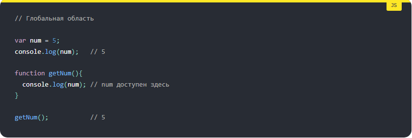
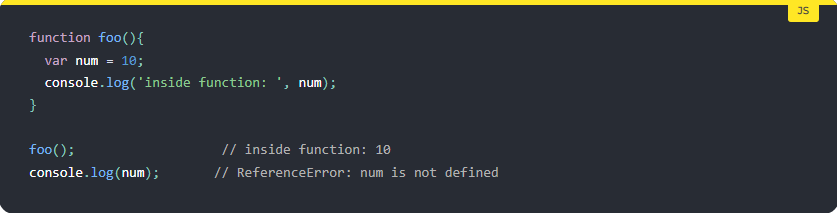
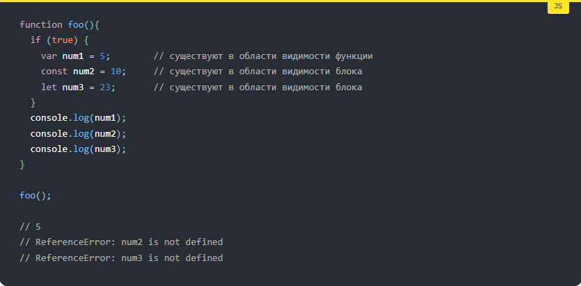
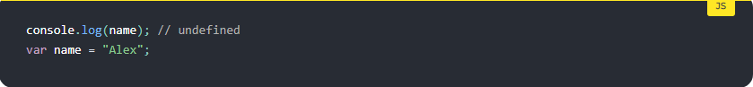
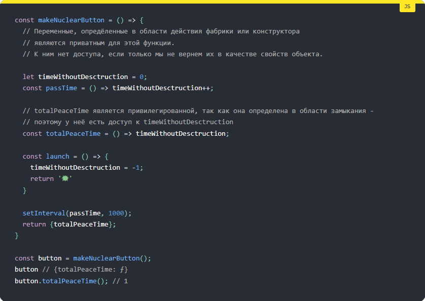
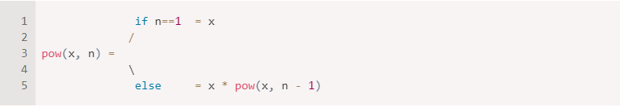

# Table of Contents
### 1.**SCOPE**   
### 2.**HOISTING**
### 3.**Recursion**
### 4.**Closure**
_________________

## Понятие Scope в JavaScript 

Область видимости — это часть программы, в которой мы можем обратиться к переменной, функции или объекту. Этой частью может быть функция, блок или вся программа в целом — то есть мы всегда находимся как минимум в одной области видимости. Области видимости можно представить как коробки, в которые мы кладём переменные.

Минтакай муаян (област видимости) - минтакай муаяне ки  дар он кадом пременахо (veriable) ва кадом функцияхо (function) кор кунанд!

### JavaScript имеет следующие типы областей видимости: Нимудхои област видимости ! Чанд намуд хастанд?

* Глобальная область видимости или **Global Scope**.
* Область видимости функции **Function Scope**
* Область видимости блока **Block Scope**
* **Module scope**

### 1.Глобальная область видимости или Global Scope
В JavaScript есть только одна **глобальная область**. Область за пределами всех функций считается глобальной областью, и переменные, определенные в глобальной области, могут быть доступны и изменены в любых других областях.

### 2. Function Scope (Область видимости функции)
Переменные объявленные в функции не могут быть доступными где-нибудь вне этой функции, поэтому переменные (которые нужны именно для функции) объявляют только в scope функции

Коида: Област видимости функции -  хама вахт лакальниян ва глабалнира хонда наметонан , глабальная боша  лаклнира мебина ва мотонаш хондан!

### 3.Block scope (Область видимости блока)

Область видимости блока - это область в **условиях if** или **циклов for**, и **while**. Вообще говоря, всякий раз, когда мы видим **фигурные скобки {}** - это блок. 

_________________

## Hoisting в JavaScript

Что такое "поднятие" и как оно работает в JavaScript.

1. Поднятие (hoisting).
2. Поднятие функций.
3. Поднятие const, let и var.
    - Ключевое слово var
    - Ключевое слово const/let

Hoisting — это механизм в JavaScript, в котором переменные и объявления функций, передвигаются вверх своей области видимости перед тем, как код будет выполнен.

Hoisting - 2 холат дора ки кор мекунанд:

1. hosting - дар variable (переменная) **var** кор мекна - undefined (неопределенный) джавоб мегирем.
2. hosting - дар **function declaration** - факат кор мекна

## Ключевые слова const / let

**let** ва **const** технический кор мекнан лекин да практика намешава! ошибкай ТDZ -да мегалтан 

Разница между объявлениями **var / function** и объявлениями **let / const** заключается в инициализации. Первые инициализируются с неопределенным значением undefined. Однако, вторые, лексически объявленные переменные, остаются не инициализированными. Это означает, что ReferenceError выбрасывается при попытке доступа к ним. Они будут инициализированы только после того, как операторы **let / const** будут определены. Всё что до, называется временной мертвой зоной.

Временная мертвая зона - это не синтаксическое местоположение, а время между созданием переменной (области) и инициализацией. Ссылка на переменную в коде над объявлением не является ошибкой, если этот код не выполняется (например, тело функции или просто мертвый код), но ошибка будет выдана, если мы запросим доступ к переменной до её инициализации.
_________________

## Замыкание. Closure

**Что такое замыкание**

Замыкание ин функцияе, ки дар даруни худаш функцияи нав фарёд мекна ва функцияи нав сохтаги доступ дора ба области берун будаги ва метавона области берунаро дар худаш сахранить ва истифода барад!

**Замыкание** обеспечивает доступ к переменным в своей **лексической области**; включая переменные родителей, которые были удалены из стека вызовов, путём определения, какие именно переменные понадобятся дочерним функциям, путём сохранения их в памяти.

Другими словами, замыкание даёт нам доступ к области видимости внешней функции из внутренней функции. В JavaScript замыкания создаются каждый раз, когда во время создания функции, внутри неё создаётся ещё одна функция.

Например, в приведенном ниже примере, мы не хотим показывать функцию **launch** для её вызова, а также не даём доступ к **timeWithoutDesctruction**:

Таким образом, мы скрываем данные объекта, которые не должны быть напрямую доступны. Вместо прямого доступа к данным нужно вызывать методы.
_________________

# Рекурсия -  recursion

Рекурсия (recursion) — это поведение функции, при котором она вызывает сама себя. Такие функции называются рекурсивными. В отличие от цикла, они не просто повторяются несколько раз, а работают «внутри» друг друга.

### Кто пользуется рекурсией и зачем она нужна

Рекурсия время от времени нужна программистам, чтобы решать различные задачи. Есть задания, которые проще и интуитивно понятнее решаются с ее помощью, а есть те, для которых есть более оптимальные алгоритмы.

### Отличия рекурсии от цикла

На интуитивном уровне рекурсивный вызов легко перепутать с циклом. И то, и другое понятие подразумевает, что функция выполняется несколько раз. Но есть принципиальное различие:

в цикле новые функции не вызываются внутри вызванных ранее;
рекурсия же — это функция, вызывающая сама себя с другими аргументами.
Простыми словами: инструкция с пунктом «Вернись к пункту 1» — это цикл, инструкция с пунктом «Прочитай инструкцию заново» — рекурсия.

Но тем не менее циклами часто заменяют рекурсию, например в ситуациях, где рекурсивные алгоритмы оказываются слишком ресурсоемкими. Правда, для использования циклов в качестве замены рекурсии понадобятся дополнительные ухищрения.

В качестве первого примера напишем функцию **pow(x, n)**, которая возводит x в натуральную **степень n**. Иначе говоря, умножает x на само себя n раз.

    > pow(2, 2) = 4
    
    > pow(2, 3) = 8
    
    > pow(2, 4) = 16

Рассмотрим два способа её реализации.

1. Итеративный способ: цикл **for**:

2.Рекурсивный способ: упрощение задачи и вызов функцией самой себя:

Обратите внимание, что рекурсивный вариант отличается принципиально.

Когда функция pow(x, n) вызывается, исполнение делится на две ветви:

1.Если **n == 1**, тогда всё просто. Эта ветвь называется базой рекурсии, потому что сразу же приводит к очевидному результату: **pow(x, 1)** равно x.
2.Мы можем представить **pow(x, n)** в виде: **x * pow(x, n - 1)**. Что в математике записывается как: **xn = x * xn-1**. Эта ветвь – шаг рекурсии: мы сводим задачу к более простому действию (умножение на x) и более простой аналогичной задаче (pow с меньшим n). Последующие шаги упрощают задачу всё больше и больше, пока n не достигает.

Например, рекурсивный вариант вычисления pow(2, 4) состоит из шагов:

    > 1.pow(2, 4) = 2 * pow(2, 3)

    > 2.pow(2, 3) = 2 * pow(2, 2)

    > 3.pow(2, 2) = 2 * pow(2, 1)
    
    > 4.pow(2, 1) = 2

Итак, рекурсию используют, когда вычисление функции можно свести к её более простому вызову, а его – к ещё более простому и так далее, пока значение не станет очевидно.